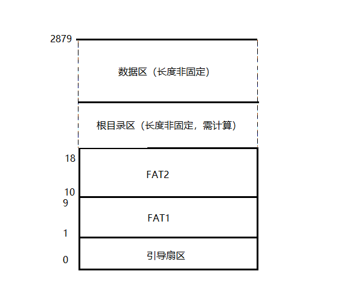
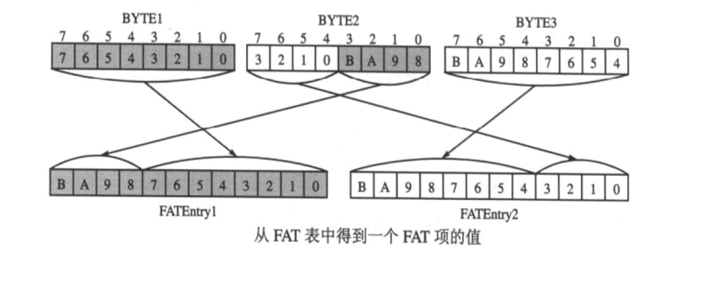

# FAT12

FAT12是DOS时代开始使用的文件系统，目前仍在软盘上使用几乎。通常文件系统将磁盘划分为若干层次以方便组织和管理，这些层次包括：

* 扇区(Sector): 磁盘上的最小数据单元。
* 簇(Cluster)：一个或多个扇区。
* 分区(Partition)：通常指整个文件系统

引导扇区是整个软盘的第0个扇区，在这个扇区中有一个很重要的数据结构叫做BPB(BIOS Parameter Block)， 引导扇区的格式如下所示，其中名称以BPB_开头的域属于BPB，以BS_开头的域不属于BPB，只是引导扇区(Boot Sector)的一部分。

|名称|开始字节|长度|内容|引导盘参考值|
|---|---|---|---|---|
|BS_jmpBoot|0|3|一个短跳转指令|jmp LABEL_START   nop|
|BS_OEMName|3|8|厂商名|'Hello OS'|
|BPB_BytsPerSec|11|2|每扇区字节数|0x200|
|BPB_SecPerClus|13|1|每簇多少扇区|0x1|
|BPB_RsvdSecCnt|14|2|Boot 记录占用多少扇区|0x1|
|BPB_NumFATs|16|1| 共有多少 FAT 表|0x2|
|BPB_RootEntCnt|17|2|根目录文件数最大值|0xE0|
|BPB_TotSec16|19|2|逻辑扇区总数|0xB40|
|BPB_Media|21|1| 媒体介质描述符|0xF0|
|BPB_FATSz16|22|2|每FAT扇区数|0x9|
|BPB_SecPerTrk|24|2| 每磁道扇区数|0x12|
|BPB_NumHeads|26|2|磁头数(面数)|0x2|
|BPB_HiddSec|28|4| 隐藏扇区数|0|
|BPB_TotSec32|32|4|如果BPB_TotSec16为0时，由这个值记录扇区数|0|
|BS_DrvNum|36|1|中断 13 的驱动器号|0|
|BS_Reserved1|37|1| 未使用|0|
|BS_BootSig|38|1| 扩展引导标记 (29h)|0x29|
|BS_VolID|39|4| 卷序列号|0|
|BS_VolLab|43|11|卷标, 必须 11 个字节|'HelloOS0.01'|
|BS_FileSysType|54|8|文件系统类型, 必须 8个字节|'FAT12   '|
|引导代码及其他|62|448|引导代码、数据及其他填充字符|引导代码（剩余空间被0填充）|
|结束标志0xAA55|510|2| 第510字节为0x55, 第511字节为0xAA|0xAA55|

紧接着引导扇区的是两个完全相同的FAT表，每个FAT占用9个扇区。第二个FAT之后是根目录区的第一个扇区。根目录去的后面是数据区，如下图：

根目录区中的每一个条目占用32字节，它的格式如下：

|名称|偏移（字节）|长度（字节数）|描述|
|---|---|---|---|
|DIR_Name|0|0xB|文件名8字节，扩展名3字节|
|DIR_Attr|0xB|1|文件属性|
|保留位|0xC|10|保留位|
|DIR_WrtTime|0x16|2|最后一次写入时间|
|DIR_WrtDate|0x18|2|最后一次写入日期|
|DIR_FstClus|0x1A|2|此条目对应的开始簇号|
|DIR_FileSize|0x1C|4|文件大小|

> 注意： 数据区的第一个簇的簇号是2，而不是0或者1

## FAT表的结构

FAT表有两个，FAT2可看做是FAT1的备份， 它们通常一样的。

每12位称为一个FAT项（FATEntry），代表一个簇。第0个和第1个FAT项始终不使用，从第2个FAT项开始表示数据区的每一个簇。

FAT项的值代表文件下一个簇号，但如果值大于或等于0xFF8, 择表示当前簇已经是本文件的最后一个簇。如果值为0xFF7, 表示它是一个坏簇。