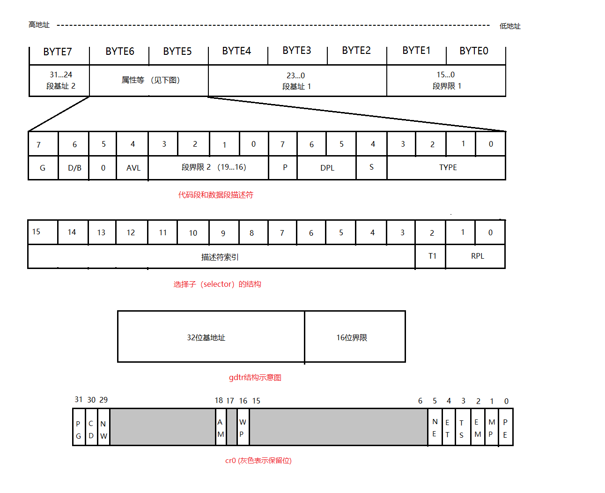

# GDT 相关




```
(1) P: 存在(Present)位。
	P=1 表示描述符对地址转换是有效的，或者说该描述符所描述的段存在，即在内存中；
	P=0 表示描述符对地址转换无效，即该段不存在。使用该描述符进行内存访问时会引起异常。
	
(2) DPL: 表示描述符特权级(Descriptor Privilege level)，共2位。它规定了所描述段的特权级，用于特权检查，以决定对该段能否访问。 

(3) S: 说明描述符的类型。
	对于存储段描述符而言，S=1，以区别与系统段描述符和门描述符(S=0)。 

(4) TYPE: 说明存储段描述符所描述的存储段的具体属性。
	 
	数据段类型	类型值		说明
			----------------------------------
			0		只读 
			1		只读、已访问 
			2		读/写 
			3		读/写、已访问 
			4		只读、向下扩展 
			5		只读、向下扩展、已访问 
			6		读/写、向下扩展 
			7		读/写、向下扩展、已访问 

		
	代码段类型	类型值		说明
			----------------------------------
			8		只执行 
			9		只执行、已访问 
			A		执行/读 
			B		执行/读、已访问 
			C		只执行、一致码段 
			D		只执行、一致码段、已访问 
			E		执行/读、一致码段 
			F		执行/读、一致码段、已访问 

		
	系统段类型	类型编码	说明
			----------------------------------
			0		<未定义>
			1		可用286TSS
			2		LDT
			3		忙的286TSS
			4		286调用门
			5		任务门
			6		286中断门
			7		286陷阱门
			8		未定义
			9		可用386TSS
			A		<未定义>
			B		忙的386TSS
			C		386调用门
			D		<未定义>
			E		386中断门
			F		386陷阱门

(5) G: 段界限粒度(Granularity)位。
	G=0 表示界限粒度为字节；
	G=1 表示界限粒度为4K 字节。
    注意，界限粒度只对段界限有效，对段基地址无效，段基地址总是以字节为单位。 

(6) D: D位是一个很特殊的位，在描述可执行段、向下扩展数据段或由SS寄存器寻址的段(通常是堆栈段)的三种描述符中的意义各不相同。 
	⑴ 在描述可执行段的描述符中，D位决定了指令使用的地址及操作数所默认的大小。
		① D=1表示默认情况下指令使用32位地址及32位或8位操作数，这样的代码段也称为32位代码段；
		② D=0表示默认情况下，使用16位地址及16位或8位操作数，这样的代码段也称为16位代码段，它与80286兼容。可以使用地址大小前缀和操作数大小前缀分别改变默认的地址或操作数的大小。 
	⑵ 在向下扩展数据段的描述符中，D位决定段的上部边界。
		① D=1表示段的上部界限为4G；
		② D=0表示段的上部界限为64K，这是为了与80286兼容。 
	⑶ 在描述由SS寄存器寻址的段描述符中，D位决定隐式的堆栈访问指令(如PUSH和POP指令)使用何种堆栈指针寄存器。
		① D=1表示使用32位堆栈指针寄存器ESP；
		② D=0表示使用16位堆栈指针寄存器SP，这与80286兼容。 

(7) AVL:  软件可利用位。80386对该位的使用未做规定，Intel公司也保证今后开发生产的处理器只要与80386兼容，就不会对该位的使用做任何定义或规定。 

```